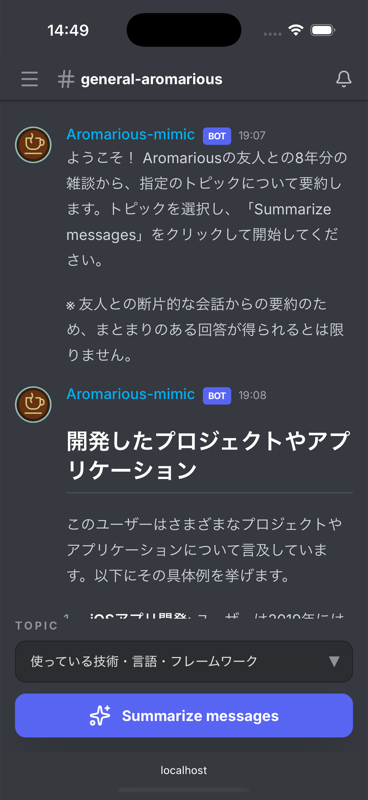

# Mimicord (Portfolio Snapshot)

> [!CAUTION]
> **これはポートフォリオ用に作成されたスナップショットであり、このリポジトリ上での動作を意図していません。**
> 動作に必要なデータベース接続情報や環境変数、一部の構築済みファイルはセキュリティの観点から除外されています。
> オリジナルの開発環境とは異なりますのでご注意ください。

---

# Mimicord

<a href="https://github.com/aromarious/mimicord-app/actions/workflows/full-test-deploy.yml"></a>
<a href="https://github.com/aromarious/mimicord-app/actions/workflows/semgrep.yml"></a>
[](https://opensource.org/licenses/MIT)
[](https://nodejs.org/)
[](https://pnpm.io/)

Discord の会話履歴を RAG (Retrieval-Augmented Generation) で要約・検索できるフルスタック Web アプリケーション

## プロジェクト概要

Discord のデータリクエスト機能で取得した会話履歴を PostgreSQL + pgvector に蓄積し、OpenAI の LLM と連携させることで、特定トピックに関する過去のやり取りを検索・要約して表示します。

**デモ**: [https://mimicord.aromarious.com](https://mimicord.aromarious.com)

<div align="center">
  
</div>

## システム構成図


## 技術スタック

### フロントエンド

- **Next.js 16 (App Router)** - 最新の App Router 構成による堅牢なフロントエンド基盤
- **React 19** - 最新の React バージョンによる開発
- **Tailwind CSS v4** - ユーティリティファーストの高速スタイリング
- **React Markdown** - Markdown レンダリング

### バックエンド

- **Hono (with Zod OpenAPI)** - 型安全な OpenAPI スキーマ定義とバリデーション
- **BetterAuth** - 型安全な認証ライブラリ（GitHub OAuth 対応）
- **Drizzle ORM** - TypeScript ファーストの ORM
- **PostgreSQL + pgvector** - ベクトル検索対応データベース（Neon ホスティング）
- **OpenAI API** - text-embedding-3-small / GPT-4o-mini による RAG 実装
- **Scalar** - インタラクティブな API リファレンス UI

### データパイプライン

- **dbt** - データ変換パイプラインの管理
- **MotherDuck** - クラウドネイティブな Serverless DuckDB
- **OpenAI Embeddings** - text-embedding-3-small（1536次元）によるベクトル化

### 開発ツール・インフラ

- **Antigravity** - AI駆動型開発を加速させる次世代コーディングエージェント
- **Ultracite** - AI対応のコード品質管理ツール（Biome設定の自動化）
- **pnpm + Turborepo** - モノレポ管理による効率的なビルド
- **Biome** - 高速な Lint / Format ツール
- **Vitest** - 単体・統合テスト
- **Playwright** - E2E テスト
- **GitHub Actions** - CI/CD パイプライン
- **Infisical** - 環境変数の安全な管理
- **Docker Compose** - ローカル開発環境

## プロジェクト構成

```text
.
├── apps/
│   └── web/                 # Next.js アプリケーション (Port 3000)
│       ├── app/             # App Router ページ・レイアウト
│       │   ├── api/         # API Routes (Hono統合)
│       │   └── auth/        # 認証関連ページ
│       ├── frontend/        # フロントエンド実装
│       │   ├── components/  # UIコンポーネント
│       │   ├── hooks/       # カスタムフック
│       │   └── api/         # クライアントAPI定義
│       ├── lib/             # ユーティリティ・クライアント
│       │   ├── auth.ts      # BetterAuth設定
│       │   └── rag/         # RAG エンジン実装
│       ├── server/          # Hono API実装
│       │   ├── routes/      # APIルート定義
│       │   ├── middleware/  # 認証ミドルウェア
│       │   ├── domain/      # ドメインエンティティ
│       │   └── usecase/     # ビジネスロジック
│       ├── test-e2e/        # E2Eテスト (Playwright)
│       └── env.ts           # 環境変数スキーマ (Zod)
│
├── packages/
│   ├── db/                  # データベース・ORM設定
│   │   ├── src/             # DB接続・スキーマ定義
│   │   └── drizzle.config.ts
│   ├── logger/              # 構造化ログライブラリ (Pino)
│   └── config/              # 共通設定ファイル
│       ├── docker-compose.yml
│       ├── biome.json       # Lint/Format設定
│       └── commitlint.config.js
│
├── dbt/                     # データパイプライン (MotherDuck → pgvector)
│   ├── models/              # dbt モデル定義
│   └── scripts/             # Embedding・投入スクリプト
│
├── docs/                    # ドキュメント
├── .github/workflows/       # CI/CD定義
└── .husky/                  # Git Hooks (Commitlint, Lint-staged)
```

## 主な機能

### 会話要約（RAG エンジン）

- トピック指定による過去の会話検索
- OpenAI GPT-4o-mini による自動要約生成
- Markdown 形式での読みやすい表示

### 認証システム

- BetterAuth + GitHub OAuth による安全なログイン
- セッション管理・有効期限制御

### API 外部連携・仕様書

- **API Reference**: Scalar によるインタラクティブなドキュメント ([表示する](https://mimicord.aromarious.com/api/reference))
- **OpenAPI 3.0**: Hono Zod OpenAPI による正確なスキーマ定義

## アーキテクチャ・設計の特徴

### RAG 実装の工夫

- **ベクトル検索の最適化**: pgvector の HNSW インデックスによる高速類似度検索
- **チャンク設計**: 会話セッション単位での分割による文脈の保持
- **匿名化処理**: 環境変数ベースの実名→エイリアス変換による個人情報保護

### 型安全性・品質保証

- **End-to-End 型安全性**: Hono RPC による API クライアント自動生成
- **スキーマ駆動開発**: Zod による環境変数・API リクエストのバリデーション
- **OpenAPI 仕様書**: Hono + Scalar による仕様書の自動生成

### セキュリティ対策

- **認証・認可**: BetterAuth によるセッション管理（GitHub OAuth）
- **レート制限**: Upstash Redis + Vercel Edge Middleware
- **環境分離**: 本番/プレビュー/ローカル環境での厳格な設定管理
- **CSP ヘッダー**: Content Security Policy による XSS 対策

## 開発・運用体制

### CI/CD パイプライン

- **PR 時**: Lint、型チェック、ビルド、単体・統合テスト実行
- **main/develop マージ時**: 上記 + E2E テスト（Playwright）実行
- **自動デプロイ**: Vercel による本番・プレビュー環境への自動デプロイ
- **依存関係更新**: Dependabot による週次自動 PR

### テスト戦略

- **単体テスト**: Vitest による UseCase・Service 層のテスト
- **統合テスト**: Hono API エンドポイントのリクエスト/レスポンステスト
- **E2E テスト**: Playwright による認証フロー・投稿機能の動作確認
- **テストカバレッジ**: 主要ビジネスロジックの網羅的なテスト

### コード品質管理

- **Ultracite**: AI対応のコード品質管理ツール（Biome設定の自動化）
- **Biome**: 高速な Lint・Format（コミット時自動実行）
- **Conventional Commits**: コミットメッセージの自動チェック
- **Husky + lint-staged**: Git Hooks による品質ゲート
- **TypeScript strict モード**: 厳格な型チェック
- **Semgrep**: 静的セキュリティスキャン（PR 時・週次定期実行）

### 環境変数管理

- **Infisical**: シークレット管理プラットフォームによる安全な環境変数の一元管理
- **環境分離**: 本番/プレビュー/ローカル環境ごとの設定を厳格に分離

## ドキュメント

### ウェブアプリ設計・仕様

- [技術要件・アーキテクチャ設計書](docs/technical_spec.md) - ウェブアプリアーキテクチャ
- [API 設計ガイドライン](docs/api_design_guidelines.md) - API 設計の原則
- [API バージョニングガイド](docs/api_versioning.md) - API バージョン管理戦略
  - [データベーススキーマガイドライン](docs/api-versioning-database-guidelines.md) - DB 変更時の互換性管理
  - [ディレクトリ構造ガイドライン](docs/api-versioning-directory-structure.md) - バージョン別ファイル配置
- [Hono API 実装標準](docs/server_standards.md) - サーバーサイド実装標準
- [クライアント使用ガイド](docs/client_usage.md) - Hono RPC クライアントの使い方
- [認証フロー](docs/auth-flow.md) - Better Auth 認証の実装詳細

### データパイプライン

- [dbt Data Pipeline](dbt/README.md) - MotherDuck + pgvector によるRAG用データ構築

### テスト

- [E2E テスト](docs/e2e-testing.md) - Playwright E2E テストの書き方

### 運用

- [CI/CD ガイドライン](docs/ci_guideline.md) - CI/CD の詳細と運用方法
- [ログの仕組み](docs/logging.md) - 構造化ログとエラートラッキング

## セットアップ

開発を開始する手順は以下を参照してください：

- **[Quickstart Guide](docs/quickstart.md)** - 開発者向けセットアップ手順
- **[Admin Setup Guide](docs/admin_setup.md)** - 管理者向けプロジェクト作成手順
- **[環境定義と実行ガイド](docs/environments.md)** - 環境変数・実行環境の説明

## ライセンス

MIT
